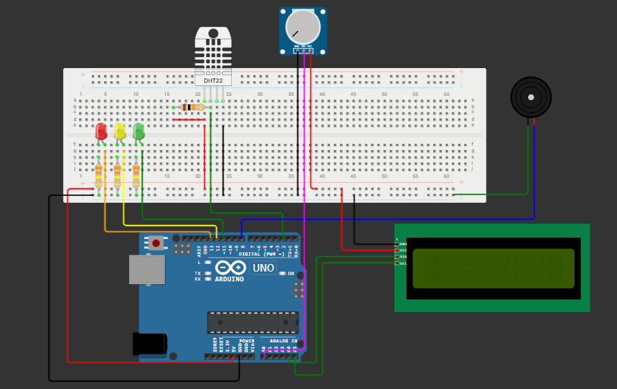

<h1 align="center">🚀 FloodGuard - Medindo o nivel do rio, umidade e emitindo alerta 🌧 💧 🚨</h1>

  <strong>🚨 🔧 💡</strong>

  Um projeto incrível com Arduino, DHT22, e potenciômetro !

# Equipe
- Giovana Bernardino Carnevali 566196
- João Vitor Parizotto Rocha 562719
- Anna Clara Ruggeri 565553

## 🎯 Objetivo
Uma solução de baixo custo e que seja acessível a todos.  
Monitorando enchentes, de baixo custo, que seja capaz de coletar dados em tempo real do nível da água, chuva, temperatura e humidade. Os enviando a um sistema de alerta para as pessoas que estiverem prestes a terem suas áreas alagadas, poderem tomar uma decisão rápida. Evitando grandes prejuízos.
O sistema funcionará da seguinte forma: Por meio do sistema de Arduino, integrado com sensores especializados o pluviômetro para medir a precipitação, e o sensor DHT22 para monitorar a temperatura e humidade. Todos esses dados serão coletados e transmitidos, em tempo real, para uma plataforma nuvem, onde poderão ser acessados por autoridades e residentes da região. Assim, criando um sistema de alerta antecipado, com notificações automáticas caso tenha algum risco de alagamentos ou enchentes.

## 🛠️ Componentes
- 1 Arduino Uno
- Arduino IDE
- 1 protoboard
- 1 Led Vermelho
- 1 Led Amarelo
- 1 Led Verde
- 3 resistores de 330Ω
- 1 resistor 10kΩ
- 1 buzzer
- 1 potenciômetro (pluviômetro fora da simulação)
- 1 DHT22
- 1 LCD
- jumpers

## 📚 Bibliotecas
- DHT22
- LiquidCrystal I2C
- Adafruit Unified Sensor
- DHT sensor library

## 📝 Passo a passo interativo

Siga os passos abaixo para iniciar o projeto em seu ambiente local:

1️⃣ **Copie o código no Arduino IDE ou em um simulador**

2️⃣ **Monte o circuito**

   Com a tenção e cuidado monte o seguinte circuito, mas lembre-se, existe outras maneiras de montagem.

3️⃣ **Compilar o código**

   Após certificar-se que o arduino está conectado a máquina, compilar seu código ultilizando o atalho ctrl+R ou cessar o comando de compilar na aba Sketch -> Verify/Compile. Em caso de erro, corrigir o código, caso o código estaja correto mas mesmo assim nada acontecer, revise o circuito.

4️⃣ **Confira o resultado**
Teste diferentes iluminações, umidades e temperaturas e observe o resultado.
https://wokwi.com/projects/430475375536374785

  Espero que este guia tenha sido útil e que você consiga reproduzir esse projeto.🎉😄

